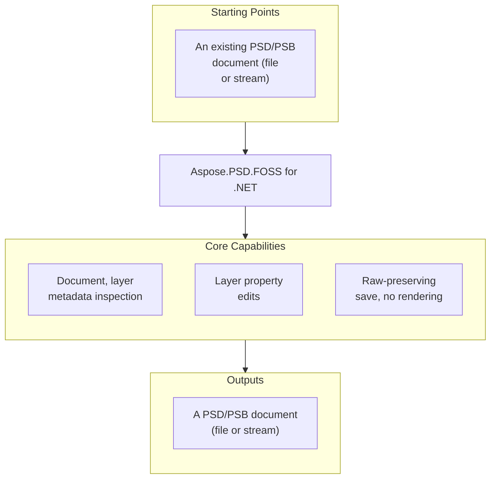

# Aspose.PSD.FOSS for .NET

 [](https://github.com/aspose-psd-foss/Aspose.PSD-FOSS-for-.NET/graphs/contributors)

[](https://products.aspose.org/psd/net/)

Aspose.PSD.FOSS is a free, open-source .NET library for loading, inspecting, and making a
limited set of layer-metadata edits to PSD/PSB files, then saving the result back without
rendering. It is for PSD/PSB inspection and small, targeted layer-property edits — not a
rendering engine, a raster editor, or an open-source replacement for the full commercial
Aspose.PSD product.

## Navigation

- [At a Glance](#at-a-glance)
- [Key Capabilities](#key-capabilities)
- [Installation](#installation)
- [Dependencies](#dependencies)
- [Quick Start](#quick-start)
- [Additional Examples](#additional-examples)
- [API Reference](#api-reference)
- [Documentation & Resources](#documentation--resources)
- [Scope and Limitations](#scope-and-limitations)
- [Development and Testing](#development-and-testing)
- [License](#license)

## At a Glance



## Key Capabilities

- Loads and inspects a PSD document, or the currently supported subset of the PSB large-document
  format, from .NET code in the Aspose.PSD-compatible style — `(PsdImage)Image.Load(path)` or
  `Image.Load(stream)` — and reads real document properties from the parsed header: `Width`,
  `Height`, `ChannelsCount`, `BitsPerChannel`, and `ColorMode`. `Compression` comes from the
  merged image data section, and `Version` is a fixed Aspose.PSD-compatible marker (see
  [Scope and Limitations](#scope-and-limitations)).
- Reads layer, resource, color-mode, and merged-image summaries — supported high-level metadata
  from the PSD/PSB document's own structural sections: the header (`ColorMode`), Image
  Resources (`ImageResources`), Layer and Mask Information (`Layers`), and the merged image data
  (`Compression`) — through a compact public API that exposes only this small, known subset
  rather than the whole Photoshop document model.
- Enumerates parsed layers through `image.Layers`, reading each layer's `Name`, local `Bounds`,
  `Width`/`Height`, `Top`/`Left`/`Bottom`/`Right` document-coordinate edges, `IsVisible`,
  `Opacity`, `Clipping`, and `BlendModeKey` — all 28 real PSD blend modes, from `Normal` and
  `Multiply` through `Dissolve` and `PassThrough`.
- Changes a deliberately narrow set of layer properties — `Name`, `IsVisible`, `Opacity`,
  `Clipping`, `BlendModeKey`, and the layer-record rectangle through `Top`/`Left`/`Bottom`/
  `Right` — and saves the result back with `image.Save(path)` without ever rendering a pixel.
  Geometry edits rewrite only the layer record's rectangle; the layer's channel pixel data is
  written back unchanged. Layer names are ASCII-only (see
  [Scope and Limitations](#scope-and-limitations)).
- Saves with a minimal parse-and-raw-preserve strategy: supported structures are parsed and
  rewritten only when something actually changed, and unsupported sections round-trip as raw
  bytes. A save with no mutations reproduces the original file byte-for-byte.
- Restores a seekable input stream's original position after loading, so the library can be used
  inside a larger workflow that shares one stream across several readers.

## Installation

Build the package from a clone of the repository:

```bash
git clone https://github.com/aspose-psd-foss/Aspose.PSD-FOSS-for-.NET.git
cd Aspose.PSD-FOSS-for-.NET
dotnet pack src/Aspose.PSD.FOSS/Aspose.PSD.FOSS.csproj -c Release
```

The generated `.nupkg` file is placed under `src/Aspose.PSD.FOSS/bin/Release/`. Reference it
from a consuming project with a plain `<ProjectReference>` to
`src/Aspose.PSD.FOSS/Aspose.PSD.FOSS.csproj`, or install it through a local NuGet source
registered against that `bin/Release` folder instead.

The library targets `net10.0` — see [Dependencies](#dependencies) below for the full required,
native, and development-only breakdown.

## Dependencies

### Required Package Dependencies

No required third-party package dependencies. The library builds from
`src/Aspose.PSD.FOSS/Aspose.PSD.FOSS.csproj`, which declares zero `<PackageReference>` entries —
PSD/PSB parsing and writing are implemented natively within the library.

### Native and System Requirements

- Targets `net10.0` (the .NET 10.0 SDK or later is required to build it).

### Development Dependencies

- `Microsoft.NET.Test.Sdk` 17.11.1, `NUnit` 4.2.2, `NUnit.Analyzers` 4.3.0, and
  `NUnit3TestAdapter` 4.6.0 — the NUnit test host, analyzers, and adapter used only by the test
  project.

None of these are referenced by the main library project; they apply only to
`src/Aspose.PSD.FOSS.Test/Aspose.PSD.FOSS.Test.csproj` and are never shipped with the library.

## Quick Start

```csharp
using Aspose.PSD;
using Aspose.PSD.FileFormats.Core.Blending;
using Aspose.PSD.FileFormats.Psd;
using Aspose.PSD.FileFormats.Psd.Layers;

using var image = (PsdImage)Image.Load("input.psd");

Console.WriteLine(image.Width);
Console.WriteLine(image.Height);
Console.WriteLine(image.ChannelsCount);
Console.WriteLine(image.BitsPerChannel);
Console.WriteLine(image.ColorMode);
Console.WriteLine(image.Version);
Console.WriteLine(image.Compression);
Console.WriteLine(image.Layers.Length);
Console.WriteLine(image.ImageResources.Length);

foreach (Layer layer in image.Layers)
{
    Console.WriteLine(layer.Name);
    Console.WriteLine(layer.Bounds);
    Console.WriteLine(layer.BlendModeKey);
    Console.WriteLine(layer.IsVisible);
    Console.WriteLine(layer.Opacity);
}

image.Layers[0].Name = "Updated layer";
image.Layers[0].IsVisible = false;
image.Layers[0].Left = 10;
image.Layers[0].Top = 20;
image.Layers[0].Right = 110;
image.Layers[0].Bottom = 120;
image.Layers[0].Opacity = 128;
image.Layers[0].BlendModeKey = BlendMode.Multiply;
image.Save("output.psd");
```

The examples assume the document has at least one layer — `image.Layers` is empty for a
flattened PSD (`image.IsFlatten`), and indexing `image.Layers[0]` would throw
`IndexOutOfRangeException`.

## Additional Examples

<details>
<summary>View Additional Examples</summary>

### Change Several Layer Properties at Once Before Saving

```csharp
using Aspose.PSD;
using Aspose.PSD.FileFormats.Core.Blending;
using Aspose.PSD.FileFormats.Psd;
using Aspose.PSD.FileFormats.Psd.Layers;

using var image = (PsdImage)Image.Load("input.psd");
image.Layers[0].Name = "Updated layer";
image.Layers[0].IsVisible = false;
image.Layers[0].Opacity = 128;
image.Layers[0].BlendModeKey = BlendMode.Multiply;
image.Layers[0].Clipping = 1;
image.Layers[0].Left += 1;
image.Layers[0].Top += 1;
image.Layers[0].Bottom += 1;
image.Save("output.psd");
```

### Run the Paired FOSS and Commercial Sample Projects

Every FOSS sample has a NuGet-backed twin that exercises the exact same application source
(`Program.cs` is kept byte-identical between the two) against the commercial `Aspose.PSD`
package instead of this library — useful for checking whether a migration scenario behaves the
same way against both:

| FOSS sample | NuGet sample | Main workflow | What it demonstrates |
|---|---|---|---|
| `Aspose.PSD.FOSS.Samples.Basic` | `Aspose.PSD.NuGet.Samples.Basic` | Document inspection | Aspose.PSD-compatible document metadata and supported resource/layer counts |
| `Aspose.PSD.FOSS.Samples.Layers` | `Aspose.PSD.NuGet.Samples.Layers` | Layer inspection | Layer metadata, derived geometry, blend mode key, channel information, mask data, and blending ranges |
| `Aspose.PSD.FOSS.Samples.StructuralEditing` | `Aspose.PSD.NuGet.Samples.StructuralEditing` | Supported metadata editing | Renaming layers, changing visibility, opacity, clipping, blend mode key, and geometry, then saving without rendering |
| `Aspose.PSD.FOSS.Samples.Streams` | `Aspose.PSD.NuGet.Samples.Streams` | Stream-based round trip | Loading from a stream, saving to a stream, and working with in-memory PSD/PSB data |

```bash
dotnet run --project samples/Aspose.PSD.FOSS.Samples.Basic
dotnet run --project samples/Aspose.PSD.FOSS.Samples.Layers
dotnet run --project samples/Aspose.PSD.FOSS.Samples.StructuralEditing
dotnet run --project samples/Aspose.PSD.FOSS.Samples.Streams
```

Pass your own files after `--`, for example
`dotnet run --project samples/Aspose.PSD.FOSS.Samples.Streams -- input.psd output.psd` (the
Basic and Layers samples take only an input file). If you don't pass an input file, a sample
tries the repository's own PSD test fixture; if you don't pass an output file to the stream or
structural-editing samples, they save into the repository's `tmp/` folder by default, and then
open the output folder in your file manager (Explorer, Finder, or `xdg-open`). The NuGet twins
need the commercial `Aspose.PSD` package to be restorable. The parity requirement covers sample
source and the workflow each one covers, not byte-for-byte identical output — the commercial
`Aspose.PSD` package may report different values or save different bytes for the same input.

</details>

## API Reference

`PsdImage` (the only concrete `Image` subclass) is the library's central entry point; `Layer`
carries the editable per-layer metadata it exposes through `image.Layers`, including the
official-style resource, channel, mask, and blending-range surfaces below. The public surface
spans 24 classes and enumerations across 3 modules, summarized below.

<details>
<summary>View the Full API Surface</summary>

### Core API

| Class | Description |
|---|---|
| `Image` | Provides the Aspose.PSD-compatible base image entry point for loading PSD/PSB documents. |
| `PsdImage` | Represents a PSD image that can be loaded, inspected, and saved without rendering. |
| `ResourceBlock` | Represents a PSD image resource block. |
| `StreamContainer` | Represents a stream container used by resource save APIs. |
| `Point` | Represents an ordered pair of integer x- and y-coordinates that defines a point in a two-dimensional plane. |
| `Rectangle` | Stores a set of four integers that represent the location and size of a rectangle. |
| `RectangleF` | Stores a set of four floating-point numbers that represent the location and size of a rectangle. |
| `Size` | Represents an ordered pair of integer width and height values that defines a size. |
| `ColorModes` | Defines the color modes supported by PSD files. |
| `CompressionMethod` | Defines the compression methods used for image data in PSD files. |
| `PsdVersion` | Represents the supported PSD container versions. |
| `ResourceBlockState` | Represents resource block state. |

### Core Exceptions

| Class | Description |
|---|---|
| `PsdLoadException` | Exception that is thrown when an error occurs while loading a PSD file. |
| `PsdSaveException` | Exception that is thrown when an error occurs while saving a PSD file. |

### Layers

| Class | Description |
|---|---|
| `BlendRange` | Represents a PSD layer blend range. |
| `ChannelInformation` | Represents PSD layer channel information. |
| `GlobalLayerMaskInfo` | Represents global layer mask information. |
| `Layer` | Represents a single PSD layer with basic metadata used by the FOSS library. |
| `LayerBlendingRangesData` | Represents PSD layer blending ranges data. |
| `LayerMaskData` | Defines the base class for PSD layer mask data. |
| `LayerMaskDataShort` | Defines layer mask data for layers that have only a raster or vector mask. |
| `LayerResource` | Represents a PSD layer resource. |
| `BlendMode` | Defines the blend modes used for layers in PSD files. |
| `LayerMaskFlags` | Defines PSD layer mask flags. |

#### Detailed Member Reference

- `Image` — abstract base type: static `Load(string)`/`Load(Stream)`, `Width`, `Height`,
  `Bounds`, `Save(string)`, `Save(Stream)`, `Dispose()`.
- `PsdImage` — the concrete `Image`: `BitsPerChannel`, `ColorMode` (its public setter rewrites
  the header's color mode without converting any pixel data), `Version` (always `6`; the setter
  accepts only `6`), `Layers` (its public setter replaces the whole layer list and forces the
  layer section to be rewritten), `ChannelsCount`, `Size`, `ActiveLayer` (always the first
  layer), `ImageResources`, `GlobalLayerResources`, `GlobalLayerMaskInfo`, `IsFlatten` (true
  when the document has no layers), `HasTransparencyData`, `Compression`, `GlobalAngle`.
- `Layer` — `Name`, `Bounds` (read-only local rectangle), `Width`, `Height`,
  `Top`/`Left`/`Bottom`/`Right` (mutable document-coordinate edges), `IsVisible`, `Opacity`,
  `Clipping`, `BlendModeKey`, `ChannelsCount`, `ChannelInformation`, `LayerMaskData`,
  `LayerBlendingRangesData`, and the `LayerTrailerSize` constant.
- `ChannelInformation` — `ChannelID`, `CompressionMethod` (parsed channels always report `Raw`,
  whatever the file's real channel compression), `Length` (clamped to `int.MaxValue`); read-only
  — `Layer.ChannelInformation`'s setter throws `NotSupportedException`.
- `LayerMaskData` (abstract) / `LayerMaskDataShort` — `Bottom`/`Left`/`Right`/`Top`,
  `MaskRectangle`, `DataSize`, `DefaultColor`, `Flags`, `ImageData`, plus `Padding` on the
  `LayerMaskDataShort` subclass (all report their type's defaults — see
  [Scope and Limitations](#scope-and-limitations)).
- `LayerBlendingRangesData` / `BlendRange` — `CompositeBlendRange`, `ChannelBlendRanges`,
  `Length`.
- `GlobalLayerMaskInfo` — a marker type with no exposed members; see
  [Scope and Limitations](#scope-and-limitations).
- `ResourceBlock` (abstract) — `ID`, `Name`, `Signature`, `Size`, `DataSize`, `MinimalVersion`,
  `Save(StreamContainer)` (throws `NotSupportedException` for every block this library
  returns), `ValidateValues()`.
- `LayerResource` (abstract) — `Key`, `Length`, `PsdVersion`, `Signature`,
  `Save(StreamContainer, int)`.
- `ColorModes` — `Bitmap`, `Grayscale`, `Indexed`, `Rgb`, `Cmyk`, `Multichannel`, `Duotone`,
  `Lab`.
- `CompressionMethod` — `Raw`, `RLE`, `ZipWithoutPrediction`, `ZipWithPrediction`.
- `BlendMode` — 28 members matching the real PSD blend-mode keys, from `Normal` through
  `PassThrough`, plus `Absent`. A blend-mode key this library does not recognize is read as
  `Normal`, and `Absent` (or any unmapped value) is written as `norm`.
- `PsdVersion` — `Psd`, `Psb`.
- `Rectangle` / `RectangleF` / `Point` / `Size` — Aspose.PSD-compatible geometry value types.
- `PsdLoadException` / `PsdSaveException` — thrown on a load or save failure respectively
  (`PsdSaveException` is raised when a layer name exceeds 255 bytes); loading a path that does
  not exist throws `FileNotFoundException`.

</details>

## Documentation & Resources

- **[Documentation site](https://docs.aspose.org/psd/net/)** — installation, walkthroughs, and
  feature guides for this library.
- **[How-to guides & FAQ](https://kb.aspose.org/psd/net/)** — task-focused answers for common
  PSD/PSB inspection and layer-editing questions.
- **[Full API reference](https://reference.aspose.org/psd/net/)** — the complete, browsable
  reference for all 24 public types (the [API reference](#api-reference) section above covers
  the essentials).
- **[Getting started guide](documentation/getting-started.md)** — requirements, the local build
  step, and a first inspection-and-edit walkthrough.
- **[Developer guide](documentation/developer-guide/basic-psd-operations.md)** — the full
  supported workflow surface: loading, inspecting, and modifying documents and layers.
- **[Supported features and limitations](documentation/limitations.md)** — the authoritative
  contract for what to assume is and isn't supported.
- Found a bug or have a feature request?
  [Open an issue](https://github.com/aspose-psd-foss/Aspose.PSD-FOSS-for-.NET/issues) on GitHub.

## Scope and Limitations

- **Structural inspection and limited editing only — not a rendering engine.** The library
  parses only a small supported subset of the full PSD/PSB format and never decodes or renders
  pixels; there is no raster export, no pixel editing, and no export to PNG, JPEG, or other
  raster images anywhere in the library.
- **Several Aspose.PSD-compatible members are present for API shape only and always return a
  fixed, disconnected value.** `GlobalLayerResources` always returns an empty array and its
  setter throws `NotSupportedException`; `GlobalLayerMaskInfo` always returns an empty marker
  object with no members; `HasTransparencyData` always returns `false`; `ImageResources` reads
  real preserved resource blocks but its setter throws `NotSupportedException`; `ActiveLayer`'s
  setter throws `NotSupportedException`. `GlobalAngle` is a plain stored value with no
  connection to the parsed document at all — setting it has no effect on what gets saved.
- **`LayerMaskData` reports presence only; `LayerBlendingRangesData` reports presence and byte
  length — neither reports parsed content.** A layer's `LayerMaskData` is non-null only when the
  layer genuinely has a mask subsection, but the returned object is a fresh default each time
  (`DataSize` is always `0`, and `DefaultColor`, `Flags`, `ImageData`, `MaskRectangle` and the
  edges are always their type's default, never the mask's real parsed bytes); edits to it are
  lost and its setter throws. A layer's `LayerBlendingRangesData.Length` is the raw subsection
  length minus its 4-byte length prefix, but `CompositeBlendRange`/`ChannelBlendRanges` are
  always empty defaults, not parsed ranges.
- **Image resources are read as opaque, unknown-only blocks.** `ImageResources` exposes each
  resource's `ID`, `Name`, and `DataSize`, but does not interpret any specific resource ID's
  real structure (no ICC-profile, slice, or guide semantics, for example) — only generic,
  byte-preserving read access.
- **`Version` is a fixed Aspose.PSD-compatibility marker, not the file's own version field.**
  It always reads `6`; setting it to anything other than `6` throws
  `ArgumentOutOfRangeException`. Whether a loaded file was a PSD or a PSB is not exposed through
  the public API at all — the container-type properties are internal.
- **Layer edits change layer-record metadata only.** Setting `Top`/`Left`/`Bottom`/`Right`
  rewrites the layer record's rectangle but leaves the layer's channel data lengths and pixel
  bytes exactly as they were, so a resized rectangle no longer matches its pixel data. Layer
  names are written as ASCII Pascal strings: non-ASCII characters are replaced with `?`, a name
  longer than 255 bytes makes `Save` throw `PsdSaveException`, and the layer's additional layer
  data is written back verbatim, so any Unicode layer-name block already in the file keeps its
  old value after a rename.
- **Parsed channel information is read-only and always reports `CompressionMethod.Raw`.**
  `ChannelInformation`'s `Length` is clamped to `int.MaxValue`, and
  `Layer.ChannelInformation`'s setter throws `NotSupportedException`.
- **Load enforces PSD/PSB header limits.** Channel count must be 1–56, bit depth one of 1, 8,
  16, or 32, and width and height at most 30000 pixels (PSD) or 300000 pixels (PSB); anything
  else throws `PsdLoadException`. All eight `ColorModes` values are accepted. The whole input
  stream is copied into memory before parsing.
- **`ResourceBlock.Save` is not supported** — it throws `NotSupportedException` for every block
  `ImageResources` returns, and setting a block's `ID` or `Name` affects only that returned
  copy. `ActiveLayer` always returns the first layer.
- **No full Photoshop feature set.** No text, vector, effects, smart filters, or adjustment-layer
  rendering; no semantic recognition of specific image-resource kinds; no full tagged-block
  editing.

These limitations apply only to Aspose.PSD.FOSS — they don't carry over to
[Aspose.PSD for .NET — Enterprise Edition](https://products.aspose.com/psd/net/), which adds full Photoshop
rendering, raster editing, export pipelines, richer resource and tagged-block handling, and
much wider PSD/PSB compatibility.

## Development and Testing

Run the test suite from the repository root:

```bash
dotnet test src/Aspose.PSD.FOSS.Test/Aspose.PSD.FOSS.Test.csproj
```

The test project targets `net10.0` and references the library via a plain `ProjectReference` —
no packaged dependency is required to build or test the library itself.

Each `Aspose.PSD.FOSS.Samples.*` project under `samples/` must keep its `Program.cs` identical
to its paired `Aspose.PSD.NuGet.Samples.*` project, so the same application source can be
compiled and run against both this library and the commercial `Aspose.PSD` package for every
supported migration scenario — see [Additional Examples](#additional-examples) for the full
sample matrix.

## License

This project is licensed under the MIT License. The MIT License permits use, copying,
modification, distribution, sublicensing, and commercial use, provided its copyright and
permission notice are retained. The software is provided without warranty.
